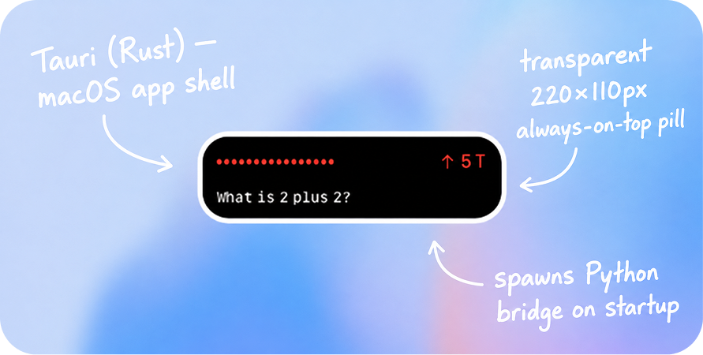
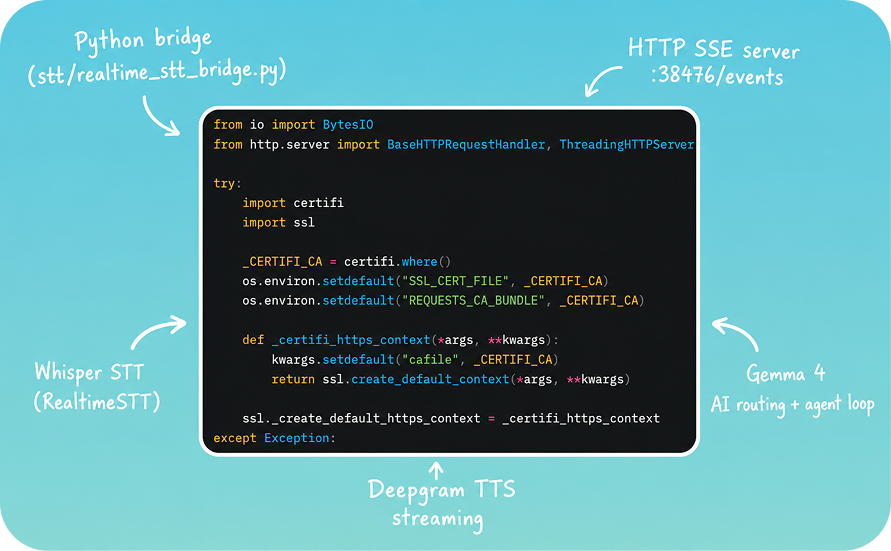
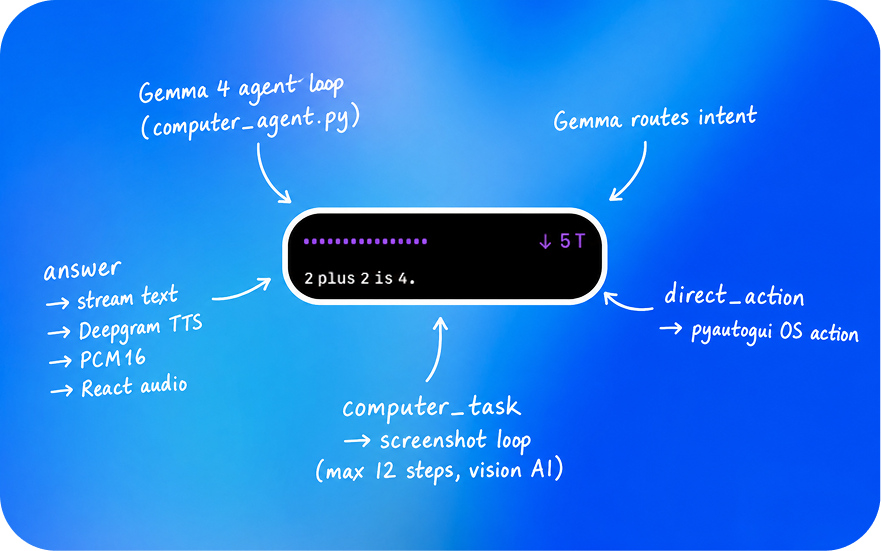

---
A floating, always-on-top, voice-controlled AI agent for hands-free computer access. Built for everyone, especially the 61 million Americans with mobility disabilities.

---
## The Problem
Over **61 million** Americans live with a mobility disability. For many, that means a keyboard and mouse are simply out of reach.
Currently, the only solutions are eye-tracking systems (that are unreliable and highly inaccurate) or intrusive brain-computer interfaces. Both options are expensive, difficult to set up, and often require users to remain impossibly still in front of a camera.

---
## What Opendesk Does
Opendesk is a lightweight, Gemma 4 powered agent that runs on your computer as an overlay and let's you control your entire computer by voice.

## Architecture

OpenDesk is three layers working together: a tiny native window, a Python brain, and an AI agent that can see and control your screen.

---

### The Frontend



The visible part of OpenDesk is a 220×110 pixel pill that floats above every other window. It's built with Tauri (a Rust framework that wraps a React app in a native macOS shell) which is what lets it stay always-on-top without eating memory like a full browser would. When the app launches, Tauri's Rust layer immediately spawns the Python bridge as a background subprocess, loads your `.env` configuration, and wires up a log file at `/tmp/open-desk-stt.log`.
The React UI inside the pill connects to that Python process over a local HTTP connection and listens for a stream of events — things like "the user started speaking", "the AI is thinking", "here's some audio to play". Everything you see (the animated audio meter, the scrolling transcript, the token counter) is driven by those events.

---

### The Bridge



The Python bridge (`stt/realtime_stt_bridge.py`) is the hub that connects your voice to the AI. It runs three threads simultaneously. The first is a small HTTP server on port 38476 that broadcasts Server-Sent Events to the React frontend. The second is the speech-to-text loop: it captures audio from your microphone, runs it through a local Whisper model for a live rolling preview, and once you stop talking it produces a finalized transcript and sends it to the AI. The third thread is the text-to-speech worker: it pulls text off a queue, streams it to the Deepgram API, and broadcasts the raw audio back to React, which plays it using the Web Audio API — all in real time, so the AI starts speaking before it's finished generating.

When a transcript arrives, the bridge asks the AI to classify what kind of request it is. A factual question goes one way. A command like "open Safari" or "press Command-Tab" goes another. Anything that requires looking at the screen and taking multiple steps triggers the full agent loop.

---

### The Agent



The computer agent (`stt/computer_agent.py`) is what makes OpenDesk actually useful for hands-free computer control. When the bridge decides a request needs visual reasoning, it hands off to an agent loop that runs up to 12 steps. Each step is the same cycle: take a screenshot of your screen, send it to the AI model along with what's happened so far, parse the action the model decides to take, and execute it. Actions can be clicks, typing, keyboard shortcuts, scrolling, opening apps or URLs, or just waiting a moment for something to load. After each action it captures a fresh screenshot so the model can see what changed before deciding what to do next. When the model decides the task is done — or the step budget runs out — the loop ends and a summary is spoken back to you.

---

## Prerequisites

| Requirement | Notes |
|---|---|
| macOS 13+ | Window transparency + always-on-top requires macOS private APIs |
| Rust + Cargo | Install via [rustup.rs](https://rustup.rs) |
| Node.js 20+ | For the React frontend |
| Python 3.12 | 3.12 recommended; 3.13+ not yet tested with all audio deps |
| Xcode Command Line Tools | `xcode-select --install` |

---

## Setup

### 1. Clone and install JS dependencies

```sh
git clone <repo-url> OpenDesk
cd OpenDesk
npm install
```

### 2. Create a Python virtual environment

```sh
python3.12 -m venv .venv312
source .venv312/bin/activate
pip install -r stt/requirements.txt
```

> The Rust shell looks for `.venv312/bin/python` first, then `.venv/bin/python`, then system `python3`.

### 3. Configure environment variables

```sh
cp .env.example .env
# Edit .env and fill in your keys (see Environment Variables below)
```

The Rust shell reads `.env` at startup and injects all variables into the Python subprocess automatically.

### 4. Run in development mode

```sh
npm run tauri dev
```

This starts the Vite dev server and the Tauri window together. The Python bridge launches automatically. Logs go to `/tmp/open-desk-stt.log`.

To run the Python bridge manually (for debugging):

```sh
source .venv312/bin/activate
cd stt
python realtime_stt_bridge.py
```

---

## Environment Variables

Copy `.env.example` to `.env` and fill in the values you need.

### Required

| Variable | Purpose |
|---|---|
| `DEEPGRAM_TTS_KEY` | Deepgram API key for text-to-speech |

Set **one** of these for the Vertex AI backend:

| Variable | Purpose |
|---|---|
| `GOOGLE_CLOUD_API_KEY` | Vertex AI Express mode key — easiest for Gemini models |
| `GOOGLE_CLOUD_PROJECT` | GCP project ID when using Application Default Credentials (required for Gemma MaaS) |

### AI model

| Variable | Default | Purpose |
|---|---|---|
| `OPEN_DESK_AI_MODEL` | `google/gemma-4-26b-a4b-it-maas` | Primary model for routing and agent steps |
| `OPEN_DESK_ROUTER_MODEL` | same as `OPEN_DESK_AI_MODEL` | Override the routing-only model |
| `OPEN_DESK_THINKING_LEVEL` | `HIGH` (Gemini 3 only) | Gemini thinking budget |

**Vertex AI location** (optional — defaults to `global`):

| Variable | Purpose |
|---|---|
| `GOOGLE_CLOUD_LOCATION` | Vertex AI endpoint region |
| `GOOGLE_CLOUD_REGION` | Alias for `GOOGLE_CLOUD_LOCATION` |

> Gemma MaaS models (`google/gemma-4-*-maas`) require ADC + `GOOGLE_CLOUD_PROJECT`. They are not available via `GOOGLE_CLOUD_API_KEY`.

### TTS

| Variable | Default | Purpose |
|---|---|---|
| `OPEN_DESK_TTS_MODEL` | `aura-2-thalia-en` | Deepgram voice model |

### STT / Whisper

| Variable | Default | Purpose |
|---|---|---|
| `OPEN_DESK_STT_MODEL` | `tiny.en` | Whisper model for final transcription |
| `OPEN_DESK_STT_REALTIME_MODEL` | `tiny.en` | Whisper model for live preview |
| `OPEN_DESK_STT_DEVICE` | `cpu` | Torch device (`cpu` or `cuda`) |
| `OPEN_DESK_STT_LANGUAGE` | `en` | Transcription language |
| `OPEN_DESK_STT_COMPUTE_TYPE` | `int8` | Whisper quantization |
| `OPEN_DESK_STT_REALTIME_PAUSE` | `0.08` | Seconds between realtime updates |
| `OPEN_DESK_STT_SILENCE_DURATION` | `0.9` | Post-speech silence before finalizing |
| `OPEN_DESK_STT_LOAD_TIMEOUT` | `90` | Seconds to wait for Whisper to load |
| `OPEN_DESK_STT_INPUT_DEVICE_INDEX` | _(auto)_ | Force a specific microphone by index |
| `OPEN_DESK_STT_INPUT_DEVICE_MATCH` | _(auto)_ | Fuzzy-match microphone by name |
| `OPEN_DESK_STT_PORT` | `38476` | SSE server port |

### Microphone selection

| Variable | Default | Purpose |
|---|---|---|
| `OPEN_DESK_MIC_DEVICE_WAIT` | `20` (macOS) / `5` | Seconds to wait for a physical mic |
| `OPEN_DESK_MIC_DEVICE_RETRY` | `0.5` | Polling interval while waiting |
| `OPEN_DESK_VIRTUAL_INPUT_NAMES` | `blackhole,soundflower,...` | Comma-separated name fragments to exclude |

### Agent / performance

| Variable | Default | Purpose |
|---|---|---|
| `OPEN_DESK_MAX_AGENT_STEPS` | `12` | Max steps in the computer-use loop |
| `OPEN_DESK_SCREENSHOT_MAX_WIDTH` | `900` | Max screenshot width sent to the model |
| `OPEN_DESK_UTTERANCE_DEBOUNCE` | `1.4` | Seconds to wait after speech stops before sending |
| `OPEN_DESK_AI_ROUTER_TIMEOUT` | `25` | Timeout (s) for the routing call |
| `OPEN_DESK_AI_ACTION_TIMEOUT` | `75` | Timeout (s) for each agent action call |
| `OPEN_DESK_AI_CHECK_TIMEOUT` | `25` | Timeout (s) for completion-check calls |
| `OPEN_DESK_AI_FINAL_TIMEOUT` | `40` | Timeout (s) for the end-of-budget assessment |
| `OPEN_DESK_SCREENSHOT_TIMEOUT` | `8` | Timeout (s) for screen capture |
| `OPEN_DESK_TIMEOUT_WORKERS` | `6` | Thread pool size for timeouts |

---

## Vertex AI authentication

**Express mode (recommended for getting started):**

```sh
GOOGLE_CLOUD_API_KEY=your-vertex-express-key
```

**Application Default Credentials:**

```sh
gcloud auth application-default login
GOOGLE_CLOUD_PROJECT=your-gcp-project-id
```

OpenDesk defaults to the `global` Vertex endpoint because some publisher models are not available on regional endpoints.

---

## Building for production

```sh
npm run tauri build
```

The signed `.dmg` and `.app` are placed in `src-tauri/target/release/bundle/`.

---

## Project structure

```
OpenDesk/
├── src/                        # React frontend
│   ├── App.tsx                 # UI component: SSE client, audio playback, state
│   ├── main.tsx                # React entry point
│   └── App.css                 # Pill styles and animations
├── src-tauri/                  # Rust / Tauri shell
│   ├── src/lib.rs              # Spawns Python bridge, window setup
│   └── tauri.conf.json         # Window config (220×110, transparent, always-on-top)
├── stt/                        # Python AI + audio backend
│   ├── realtime_stt_bridge.py  # SSE server, STT loop, AI routing, TTS
│   ├── computer_agent.py       # Screenshot, action execution, agent prompts
│   └── requirements.txt        # Python dependencies
├── .env.example                # Environment variable template
└── package.json                # JS build scripts
```

---

## Troubleshooting

**Python bridge does not start** — check `/tmp/open-desk-stt.log`.

**No microphone found on macOS** — grant microphone access to both OpenDesk and Python in *System Settings → Privacy & Security → Microphone*, then restart.

**Only virtual inputs visible** — if BlackHole or Loopback is selected as the default, grant mic access or set `OPEN_DESK_STT_INPUT_DEVICE_MATCH` to your physical mic name.

**Whisper takes too long to load** — increase `OPEN_DESK_STT_LOAD_TIMEOUT` or switch to a smaller model (`tiny.en`).
