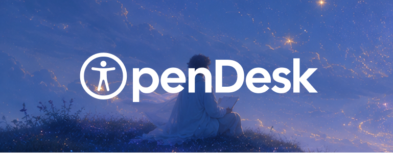
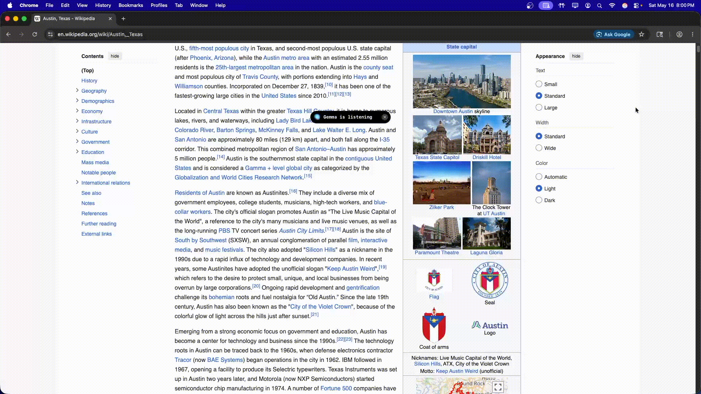

---
A floating, always-on-top, voice-controlled AI agent for hands-free computer access. Built for everyone, especially the 61 million Americans with mobility disabilities.

---
### The Problem
Over *61 million Americans* live with a mobility disability. Many simply can't use a keyboard or a mouse.
There are tools like eye tracking, switch access, and voice dictation out there. But anyone who has used them knows how frustrating they are. Slow, exhausting, and limited. You can move a cursor or dictate a word, but you still can't book a doctor's appointment or send an email without a lot of struggle or someone else's help.

For instance, eye tracking is considered one of the best accessibility solutions available today. But even a simple task can still be nearly impossible to complete accurately. Additionally, basic eye tracking setups start at around **$3,000**.

Another leading accessibility solution is Switch Access where users scan through options one by one and select with a button press or blink gesture. It works, but typing a single sentence can take minutes.

### What is Opendesk
Opendesk is a different kind of accessibility tool. It's a voice-powered AI agent built on Gemma 4 that actually understands what you want and goes and does it. You don't need a keyboard, a mouse, or anyone's help.


### How it Works
**Opendesk is three layers working together.**

**1. Frontend**
The first is the frontend. It's a small pill-shaped overlay that floats above every window on your screen. It shows you a live transcript of what you're saying, what the agent is doing, and speaks back to you when it's done.

It's built with Tauri, React, and Rust. We chose Tauri over Electron because Tauri uses the system's native webview instead of bundling a full Chromium browser, keeping the app tiny and fast. Right when the app launches, the Rust layer automatically spawns the Python backend, loads your environment configuration, and connects the React frontend to it over a local HTTP connection.

**2. Bridge**
The second layer is the Python backend. When Opendesk launches, Tauri starts a Python process in the background that does three things at once: runs a local event server that the frontend subscribes to, listens to your microphone through a local Whisper model, and handles speaking responses back to you through the Deepgram API.

The microphone handling is more careful than it sounds. On macOS, virtual audio devices like BlackHole or Loopback can interfere and get picked up instead of your real mic. Opendesk waits for a physical microphone, filters those out, and reports any issues directly to the overlay. While you speak, it shows a live transcript. When you stop, it waits just a moment before sending your request to the AI so natural pauses don't accidentally cut you off.

Once it has your request, it makes the first Gemma 4 call, a router. Gemma 4 reads what you said and returns structured JSON describing whether it's a simple answer, a one-step direct action, or a multi-step computer task. If it's a simple question, it gets answered directly. If it's a basic command like "open Chrome," it gets done immediately without touching the screen agent. Anything more complex triggers the full agent loop. This is what keeps Opendesk efficient for everyday commands.

**3. Agent**
The third and final piece is the agent, what makes Opendesk actually useful. When a task needs real computer control, the agent takes over. It works in a simple loop: take a screenshot, send it to Gemma 4 along with the goal and everything it's done so far, get back one action, execute it, then look at the screen again before deciding what to do next.

We ask the model for one action at a time on purpose. It's slower than running a script with a list of actions, but it ensures the agent is always looking at the screen before doing anything. That way it won't miss a popup, a failed click, or a page that loaded differently than expected.

Gemma 4's visual grounding capabilities are what made Opendesk possible. Gemma 4 can look at a screenshot, find a button or a text field, and return its exact x and y coordinates. Most flagship vision models still can't do that reliably. For a voice powered computer-use assistant, grounding is the heart of the system. If you can't tell the agent exactly where to click, nothing works.

Actions can be clicks, typing, keyboard shortcuts, scrolling, dragging, opening apps, opening URLs, or just waiting for something to load. While the agent is working, it narrates what it's doing out loud so the user always knows what's happening without having to watch the screen.

A lot of work went into making this loop reliable. The agent loop lives and dies on whether Gemma 4 returns clean structured JSON every single time. A bad response can break the whole loop or trajectory of the agent. That's why we built a robust set of checks into every step. For instance, before executing any action, the agent checks if it's already tried the same thing recently and switches strategy if it has. After typing anything, it compares screenshots before and after to verify the text actually landed in the right place.

After every single action, Opendesk uses Gemma 4 as a completion judge, asking whether the task is done, whether another step is needed, or whether to stop and ask the user for more information. This is what lets the agent prevent getting into loops, recover from mistakes, avoid repeating failed actions, and stop for clarification when guessing would be risky. If the user starts speaking while the agent is working, it stops immediately and listens so you never have to wait for it to finish before correcting it.

### Challenges
**Latency**
Opendesk originally ran on device but was taking 10+ minutes for even a simple task. To address this, we moved across different providers like OpenRouter and AI Studio before settling on Vertex AI using google/gemma-4-26b-a4b-it-maas. We also added screenshot caching, background refreshes, and direct-action routing to reduce latency further.

**macOS Permissions**
Opendesk needs microphone access, screen capture, accessibility controls, and always-on-top window behavior. On macOS those all sit behind different permission prompts and APIs, and getting all of them working reliably took significant trial and error.

**Frontend and Backend Sync**
The Python process and the Tauri app are completely separate so we had to build a local event protocol from scratch. The SSE (Server-Sent Events) stream carries recording state, transcripts, audio levels, agent steps, TTS chunks, and completion events.

**Real-time Speech and Barge-in**
Speech is messier than it looks as the backend has to stream partial transcripts, avoid firing during natural pauses, and handle interruptions. If the agent starts doing the wrong thing, speaking cancels it immediately, clears queued speech, and treats what you just said as the new command.

**Safe Text Entry**
Typing is riskier than it sounds because the wrong field might be focused without the agent knowing, causing the agent to go off course or even get stuck in a loop. Opendesk checks whether the screen actually changed after typing and asks the user for help after repeated failed attempts rather than keep trying.

### Impact
Opendesk started as an accessibility tool for people with mobility disabilities. But the more we built it, the more we realized the problem it solves is bigger than that. Billions of people struggle with computers not because of a physical disability but because they never had the chance to learn. 

There are entire regions of the world where digital literacy is low and people can't navigate computers confidently enough to access healthcare, education, or economic opportunity. If you can speak, you can use Opendesk. You don't need to know where the settings menu is or how to fill out a form. You just say what you want and it happens.

As Gemma models get smaller and more powerful, the vision is for Opendesk to run fully on device anywhere in the world with no internet required. Whether it's a cheap laptop in a rural clinic or a shared computer in a community center, all of it becomes fully usable with just your voice.

### Conclusion
Technology should work for everyone. Not just people who can type and click. Opendesk is a step toward a world where your voice is enough to participate fully in the digital world, no matter who you are or where you live.
---

## Prerequisites

| Requirement | Notes |
|---|---|
| macOS 13+ | Window transparency + always-on-top requires macOS private APIs |
| Rust + Cargo | Install via [rustup.rs](https://rustup.rs) |
| Node.js 20+ | For the React frontend |
| Python 3.12 | 3.12 recommended; 3.13+ not yet tested with all audio deps |
| Xcode Command Line Tools | `xcode-select --install` |

---

## Setup

### 1. Clone and install JS dependencies

```sh
git clone <repo-url> OpenDesk
cd OpenDesk
npm install
```

### 2. Create a Python virtual environment

```sh
python3.12 -m venv .venv312
source .venv312/bin/activate
pip install -r stt/requirements.txt
```

> The Rust shell looks for `.venv312/bin/python` first, then `.venv/bin/python`, then system `python3`.

### 3. Configure environment variables

**Running from source:**
```sh
cp .env.example .env
# Edit .env and fill in your keys (see Environment Variables below)
```

**Using the pre-built `.app`:** create your `.env` at:
```
~/Library/Application Support/com.karthikbhattar.open-desk/.env
```

The app reads `.env` from its data directory and injects all variables into the Python subprocess automatically.

### 4. Run in development mode

```sh
npm run tauri dev
```

This starts the Vite dev server and the Tauri window together. The Python bridge launches automatically. Logs go to `/tmp/open-desk-stt.log`.

To run the Python bridge manually (for debugging):

```sh
source .venv312/bin/activate
cd stt
python realtime_stt_bridge.py
```

---

## Environment Variables

Copy `.env.example` to `.env` and fill in the values you need.

### Required

| Variable | Purpose |
|---|---|
| `DEEPGRAM_TTS_KEY` | Deepgram API key for text-to-speech |

Set **one** of these for the Vertex AI backend:

| Variable | Purpose |
|---|---|
| `GOOGLE_CLOUD_API_KEY` | Vertex AI Express mode key — easiest for Gemini models |
| `GOOGLE_CLOUD_PROJECT` | GCP project ID when using Application Default Credentials (required for Gemma MaaS) |

### AI model

| Variable | Default | Purpose |
|---|---|---|
| `OPEN_DESK_AI_MODEL` | `google/gemma-4-26b-a4b-it-maas` | Primary model for routing and agent steps |
| `OPEN_DESK_ROUTER_MODEL` | same as `OPEN_DESK_AI_MODEL` | Override the routing-only model |
| `OPEN_DESK_THINKING_LEVEL` | `HIGH` (Gemini 3 only) | Gemini thinking budget |

**Vertex AI location** (optional — defaults to `global`):

| Variable | Purpose |
|---|---|
| `GOOGLE_CLOUD_LOCATION` | Vertex AI endpoint region |
| `GOOGLE_CLOUD_REGION` | Alias for `GOOGLE_CLOUD_LOCATION` |

> Gemma MaaS models (`google/gemma-4-*-maas`) require ADC + `GOOGLE_CLOUD_PROJECT`. They are not available via `GOOGLE_CLOUD_API_KEY`.

### TTS

| Variable | Default | Purpose |
|---|---|---|
| `OPEN_DESK_TTS_MODEL` | `aura-2-thalia-en` | Deepgram voice model |

### STT / Whisper

| Variable | Default | Purpose |
|---|---|---|
| `OPEN_DESK_STT_MODEL` | `tiny.en` | Whisper model for final transcription |
| `OPEN_DESK_STT_REALTIME_MODEL` | `tiny.en` | Whisper model for live preview |
| `OPEN_DESK_STT_DEVICE` | `cpu` | Torch device (`cpu` or `cuda`) |
| `OPEN_DESK_STT_LANGUAGE` | `en` | Transcription language |
| `OPEN_DESK_STT_COMPUTE_TYPE` | `int8` | Whisper quantization |
| `OPEN_DESK_STT_REALTIME_PAUSE` | `0.08` | Seconds between realtime updates |
| `OPEN_DESK_STT_SILENCE_DURATION` | `0.9` | Post-speech silence before finalizing |
| `OPEN_DESK_STT_LOAD_TIMEOUT` | `90` | Seconds to wait for Whisper to load |
| `OPEN_DESK_STT_INPUT_DEVICE_INDEX` | _(auto)_ | Force a specific microphone by index |
| `OPEN_DESK_STT_INPUT_DEVICE_MATCH` | _(auto)_ | Fuzzy-match microphone by name |
| `OPEN_DESK_STT_PORT` | `38476` | SSE server port |

### Microphone selection

| Variable | Default | Purpose |
|---|---|---|
| `OPEN_DESK_MIC_DEVICE_WAIT` | `20` (macOS) / `5` | Seconds to wait for a physical mic |
| `OPEN_DESK_MIC_DEVICE_RETRY` | `0.5` | Polling interval while waiting |
| `OPEN_DESK_VIRTUAL_INPUT_NAMES` | `blackhole,soundflower,...` | Comma-separated name fragments to exclude |

### Agent / performance

| Variable | Default | Purpose |
|---|---|---|
| `OPEN_DESK_MAX_AGENT_STEPS` | `12` | Max steps in the computer-use loop |
| `OPEN_DESK_SCREENSHOT_MAX_WIDTH` | `900` | Max screenshot width sent to the model |
| `OPEN_DESK_UTTERANCE_DEBOUNCE` | `1.4` | Seconds to wait after speech stops before sending |
| `OPEN_DESK_AI_ROUTER_TIMEOUT` | `25` | Timeout (s) for the routing call |
| `OPEN_DESK_AI_ACTION_TIMEOUT` | `75` | Timeout (s) for each agent action call |
| `OPEN_DESK_AI_CHECK_TIMEOUT` | `25` | Timeout (s) for completion-check calls |
| `OPEN_DESK_AI_FINAL_TIMEOUT` | `40` | Timeout (s) for the end-of-budget assessment |
| `OPEN_DESK_SCREENSHOT_TIMEOUT` | `8` | Timeout (s) for screen capture |
| `OPEN_DESK_TIMEOUT_WORKERS` | `6` | Thread pool size for timeouts |

---

## Vertex AI authentication

**Express mode (recommended for getting started):**

```sh
GOOGLE_CLOUD_API_KEY=your-vertex-express-key
```

**Application Default Credentials:**

```sh
gcloud auth application-default login
GOOGLE_CLOUD_PROJECT=your-gcp-project-id
```

OpenDesk defaults to the `global` Vertex endpoint because some publisher models are not available on regional endpoints.

---

## Building for production

```sh
npm run tauri build
```

The signed `.dmg` and `.app` are placed in `src-tauri/target/release/bundle/`.

---

## Project structure

```
OpenDesk/
├── assets/                     # Images and media used in docs
├── src/                        # React frontend
│   ├── App.tsx                 # UI component: SSE client, audio playback, state
│   ├── main.tsx                # React entry point
│   └── App.css                 # Pill styles and animations
├── src-tauri/                  # Rust / Tauri shell
│   ├── src/lib.rs              # Spawns Python bridge, window setup
│   └── tauri.conf.json         # Window config (220×110, transparent, always-on-top)
├── stt/                        # Python AI + audio backend
│   ├── realtime_stt_bridge.py  # SSE server, STT loop, AI routing, TTS
│   ├── computer_agent.py       # Screenshot, action execution, agent prompts
│   ├── requirements.txt        # Python dependencies
│   └── tests/                  # Python unit tests
├── .env.example                # Environment variable template
└── package.json                # JS build scripts
```

---

## Troubleshooting

**Python bridge does not start** — check `/tmp/open-desk-stt.log`.

**No microphone found on macOS** — grant microphone access to both OpenDesk and Python in *System Settings → Privacy & Security → Microphone*, then restart.

**Only virtual inputs visible** — if BlackHole or Loopback is selected as the default, grant mic access or set `OPEN_DESK_STT_INPUT_DEVICE_MATCH` to your physical mic name.

**Whisper takes too long to load** — increase `OPEN_DESK_STT_LOAD_TIMEOUT` or switch to a smaller model (`tiny.en`).
